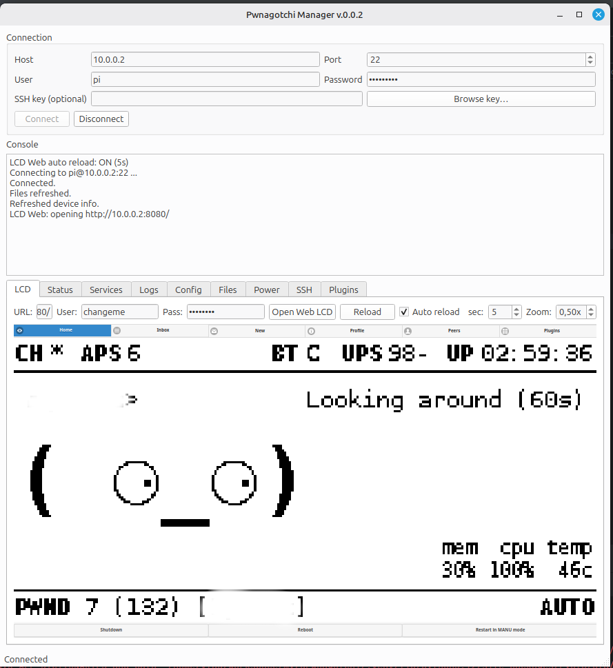

# qPwnagotchi — Pwnagotchi Manager

A small PyQt6 desktop app to manage **your own** Pwnagotchi over SSH.



This project intentionally does **not** provide features for offensive actions.
It is a remote-admin convenience tool for a device you already own.

## Features

- **Status** — uptime, disk usage, IP address, service state.
- **Service control** — start / stop / restart / status of `pwnagotchi.service`.
- **Logs** — tail and browse `journalctl` / pwnagotchi logs.
- **Config editor** — edit `/etc/pwnagotchi/config.toml` with an automatic
  on-device backup before each save.
- **Plugins** — discover plugins from the usual on-device directories
  (including the well-known `availaible-plugins` typo path) and toggle
  `main.plugins.<name>.enabled` in `config.toml`.
- **Files** — SFTP file manager: upload / download / browse.
- **Export folder** — bulk pull a remote directory to local disk.
- **Embedded SSH terminal** — interactive shell in a tab.
- **Fleet view** — poll multiple saved devices at once.
- **LCD preview** — embedded view of the on-device web UI / display.
- **Profiles** — saved connection profiles (host, port, user, key/password).
- **Reboot / shutdown** of the remote device.

## Project layout

```
app.py                       entry point
pwnman/pwnman/               UI + SSH + fleet code
  ui_main.py                 main window, tabs, plugin/config logic
  ssh_client.py              paramiko wrapper (exec + SFTP)
  ssh_terminal.py            embedded interactive terminal widget
  fleet.py / fleet_tab.py    multi-device polling (REST + SSH probes)
  file_manager.py            SFTP browser widget
  export_folder_tab.py       bulk export tab
  profile_store.py           profile persistence
  profile_dialog.py          profile manager UI
  models.py                  ConnectionProfile dataclass
  async_utils.py             run_in_thread, shell quoting helpers
tests/                       pytest unit tests (no Qt, no network)
packaging/                   .desktop file + Debian control template
scripts/                     build.sh, build-deb.sh
Makefile                     dev + build + deb targets
```

## Running from source

```bash
make venv     # create .venv and install requirements
make run      # launches the GUI
make test     # runs the unit tests
```

Or by hand:

```bash
python3 -m venv .venv
source .venv/bin/activate
pip install -r requirements.txt
python app.py
```

Requirements: Python ≥ 3.10, PyQt6, PyQt6-WebEngine, paramiko. On Debian /
Ubuntu / Raspberry Pi OS you may also need system libs for Qt (the `.deb`
declares these as `Depends:` — see `packaging/debian/control.in`).

## Building binaries and `.deb` packages

PyInstaller produces a single-file binary; `scripts/build-deb.sh` wraps it
into a Debian package. **PyInstaller cannot cross-compile**, so you must
build on (or emulate) the target architecture.

### Host build (whatever you're sitting at)

```bash
make build    # → dist/qpwnagotchi-<version>-<arch>
make deb      # → dist/qpwnagotchi_<version>_<arch>.deb
```

Install:

```bash
sudo dpkg -i dist/qpwnagotchi_*_*.deb
sudo apt-get -f install      # if any Qt deps are missing
qpwnagotchi                  # also appears in your app menu
```

### Per-platform notes

| Target                          | Debian arch | How to build                                                                   |
| ------------------------------- | ----------- | ------------------------------------------------------------------------------ |
| Linux desktop / laptop          | `amd64`     | `make deb` on the machine.                                                     |
| ClockworkPi uConsole CM4 / A06  | `arm64`     | `make deb` on the uConsole, **or** `docker buildx` with `--platform linux/arm64`. |
| ClockworkPi uConsole (RPi 32b)  | `armhf`     | `make deb` on the uConsole, **or** `--platform linux/arm/v7`.                  |
| Raspberry Pi 4 / 5 (64-bit OS)  | `arm64`     | `make deb` on the Pi.                                                          |
| ClockworkPi uConsole R-01       | `riscv64`   | `make deb` on the device (slow; PyQt6 wheels may be unavailable — see below).  |

### Cross-arch builds via Docker buildx + qemu

This emulates the target arch on your x86_64 host. The build is slower but
produces a real native binary + `.deb`.

```bash
# one-time: install qemu-user-static + binfmt
sudo apt-get install -y qemu-user-static binfmt-support
docker run --privileged --rm tonistiigi/binfmt --install all

# arm64 (uConsole CM4, RPi 64-bit)
docker run --rm --platform linux/arm64 \
    -v "$PWD":/src -w /src debian:bookworm bash -lc '
        apt-get update &&
        apt-get install -y python3-venv python3-pip python3-dev \
            build-essential dpkg-dev file git &&
        make deb
    '

# armhf (uConsole 32-bit, RPi 3)
docker run --rm --platform linux/arm/v7 \
    -v "$PWD":/src -w /src debian:bookworm bash -lc '
        apt-get update &&
        apt-get install -y python3-venv python3-pip python3-dev \
            build-essential dpkg-dev file git &&
        make deb
    '
```

Output `.deb` files land in `dist/`.

### PyQt6 wheel availability

PyPI ships PyQt6 wheels for `manylinux x86_64` and `aarch64`. On `armhf`
and `riscv64` there are **no prebuilt wheels** — `pip install PyQt6` will
try to compile Qt from source, which is impractical on a uConsole. For
those targets, install Qt from the system package manager and skip the
PyQt6 pip dep:

```bash
sudo apt-get install python3-pyqt6 python3-pyqt6.qtwebengine python3-paramiko
# then run app.py directly, no venv needed
python3 app.py
```

A future improvement could ship an arch-specific control file that
`Depends:` on system `python3-pyqt6` instead of bundling Qt via
PyInstaller. For now, the `.deb` route is recommended on `amd64` and
`arm64`; on other arches, run from source against system PyQt6.

## Cleaning up

```bash
make clean      # removes build/, dist/, __pycache__
make distclean  # also removes .venv
```

## License

See repository.
